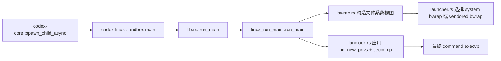

# Codex 的 Linux Sandbox 管线

这篇文档面向刚接触 Codex 源码的读者，目标是把 Linux sandbox 的“整条流水线”讲清楚。

你可以先记住一句话：

> Codex 在 Linux 上不是只靠一个工具做隔离，而是分成两层。
> 外层用 bubblewrap 搭出文件系统和命名空间视图，内层再用 `no_new_privs` + seccomp 把剩下的危险系统调用收紧。

如果你只想先看源码主线，可以从这些提交固定链接开始：

- [linux-sandbox/src/lib.rs](https://github.com/openai/codex/blob/47a9e2e084e21542821ab65aae91f2bd6bf17c07/codex-rs/linux-sandbox/src/lib.rs)
- [linux-sandbox/src/linux_run_main.rs](https://github.com/openai/codex/blob/47a9e2e084e21542821ab65aae91f2bd6bf17c07/codex-rs/linux-sandbox/src/linux_run_main.rs)
- [linux-sandbox/src/bwrap.rs](https://github.com/openai/codex/blob/47a9e2e084e21542821ab65aae91f2bd6bf17c07/codex-rs/linux-sandbox/src/bwrap.rs)
- [linux-sandbox/src/launcher.rs](https://github.com/openai/codex/blob/47a9e2e084e21542821ab65aae91f2bd6bf17c07/codex-rs/linux-sandbox/src/launcher.rs)
- [linux-sandbox/src/landlock.rs](https://github.com/openai/codex/blob/47a9e2e084e21542821ab65aae91f2bd6bf17c07/codex-rs/linux-sandbox/src/landlock.rs)
- [core/src/spawn.rs](https://github.com/openai/codex/blob/47a9e2e084e21542821ab65aae91f2bd6bf17c07/codex-rs/core/src/spawn.rs)
- [protocol/src/protocol.rs](https://github.com/openai/codex/blob/47a9e2e084e21542821ab65aae91f2bd6bf17c07/codex-rs/protocol/src/protocol.rs)

## 先认识三个概念

### 1. bubblewrap

`bubblewrap`（常写作 `bwrap`）是 Linux 上一个专门用来“拼装运行时视图”的小工具。Codex 用它来做文件系统隔离，核心动作是挂载、绑定、遮罩目录。

### 2. seccomp

seccomp 是内核级的“系统调用白名单/黑名单”。它不是管文件树，而是管进程能不能调用某些 syscall，比如 `connect`、`socket`、`ptrace`。

### 3. `PR_SET_NO_NEW_PRIVS`

这是一个内核标志，意思是“这个进程之后不要再通过 setuid 等方式获得更高权限”。seccomp 通常需要它配合，Codex 只在真的需要 seccomp，或者走旧的 Landlock 路径时才打开它。

## 整条链路长什么样

可以把 Linux sandbox 想成两段式流程：



更口语一点地说：

1. `core/src/spawn.rs` 负责把 sandbox helper 子进程拉起来。
   它还会清空并重建环境变量，网络受限时写入 `CODEX_SANDBOX_NETWORK_DISABLED`，并通过 `pre_exec` 请求 parent-death signal。
2. Linux helper 的 `main.rs` 只会转发到 `lib.rs::run_main()`。
3. `linux_run_main.rs` 解析策略，决定是走现代 bubblewrap 路径，还是旧的 Landlock 路径。
4. 如果走 bubblewrap，`bwrap.rs` 负责拼 argv，`launcher.rs` 负责真正 `exec` 到系统版或自带版 `bwrap`。
5. 如果还需要内层限制，`landlock.rs` 会在当前线程里加上 `no_new_privs` 和 seccomp。

参考：

- [core/src/spawn.rs](https://github.com/openai/codex/blob/47a9e2e084e21542821ab65aae91f2bd6bf17c07/codex-rs/core/src/spawn.rs#L19-L124)
- [linux-sandbox/src/main.rs](https://github.com/openai/codex/blob/47a9e2e084e21542821ab65aae91f2bd6bf17c07/codex-rs/linux-sandbox/src/main.rs#L1-L5)
- [linux-sandbox/src/lib.rs](https://github.com/openai/codex/blob/47a9e2e084e21542821ab65aae91f2bd6bf17c07/codex-rs/linux-sandbox/src/lib.rs#L1-L26)
- [linux-sandbox/src/linux_run_main.rs](https://github.com/openai/codex/blob/47a9e2e084e21542821ab65aae91f2bd6bf17c07/codex-rs/linux-sandbox/src/linux_run_main.rs#L101-L211)

## 1. Codex 先把策略说清楚

Codex 的策略不是一个模糊的大开关，而是几层结构化数据。

### `SandboxPolicy`

`SandboxPolicy` 是历史上更大的“总策略”视图，包含几种典型模式：

- `DangerFullAccess`
- `ReadOnly`
- `WorkspaceWrite`
- `ExternalSandbox`

它提供了三个非常重要的判断：

- `has_full_disk_read_access()`
- `has_full_disk_write_access()`
- `has_full_network_access()`

### `ReadOnlyAccess`

如果是只读模式，`ReadOnlyAccess` 决定“到底读多少”：

- `FullAccess` 表示整盘可读。
- `Restricted` 表示只允许一批显式根目录可读，默认还可以加平台基础路径。

### `WritableRoot`

`WritableRoot` 表示“这个根目录允许写，但它下面某些子路径仍然要保持只读”。这是 Codex 很关键的安全语义，因为工作区里经常会出现 `.git`、`.codex` 这种不应该被随意改写的目录。

### 为什么还要分出文件系统和网络策略

在现代路径里，Codex 更倾向于把策略拆成：

- `FileSystemSandboxPolicy`
- `NetworkSandboxPolicy`

这样做的好处是，文件系统和网络可以独立演进。`linux_run_main.rs` 里会接受“旧的总策略”，也会接受“拆开的双策略”，但不会接受一半新一半旧的混搭输入。

参考：

- [protocol/src/protocol.rs](https://github.com/openai/codex/blob/47a9e2e084e21542821ab65aae91f2bd6bf17c07/codex-rs/protocol/src/protocol.rs#L722-L1000)

## 2. 外层阶段：bubblewrap 先搭文件系统视图

真正做文件系统隔离的入口在 `bwrap.rs`。

`create_bwrap_command_args()` 会根据策略决定三件事：

1. 要不要直接放行原始命令。
2. 要不要给命令套上一层 bubblewrap。
3. bubblewrap 里具体要挂哪些目录、要不要新建 `/proc`、要不要切换网络命名空间。

### 一个很重要的优化

如果策略已经是“整盘可写”并且网络也全开，Codex 会尽量不套 bwrap，直接返回原始命令。这样做是为了少做一层不必要的包装。

但只要网络不是全开，Codex 仍然会用 bubblewrap，因为网络命名空间是 bwrap 这一层来做的。

### 文件系统视图是怎么拼出来的

`create_filesystem_args()` 的思路很像“先画底图，再打补丁”：

1. 只读模式下，先把根挂成 `--ro-bind / /`，或者在受限读模式下从 `--tmpfs /` 开始。
2. 再挂一个最小的 `/dev`，保证 `urandom`、`null` 之类的基础设备可用。
3. 把可写根目录重新 `--bind` 回来。
4. 在可写根下面，再把不该写的子目录用 `--ro-bind` 盖回去。
5. 如果路径不存在、或者是 symlink，代码会尽量把这些特殊情况遮掉，而不是让命令启动失败。

你可以把它想成这样一个伪例子：

```text
策略:
  cwd = /repo
  writable_roots = [/repo, /tmp/build]
  unreadable_roots = [/repo/.git, /repo/.codex]

bwrap 视图大致会变成:
  /             -> 只读底图或 tmpfs 底图
  /dev          -> 最小可写设备树
  /repo         -> 重新开放为可写
  /repo/.git    -> 再盖回只读
  /repo/.codex  -> 再盖回只读
  /tmp/build    -> 重新开放为可写
```

### 为什么默认会加平台基础路径

在受限只读模式下，Codex 会把一些平台默认路径也加进去，比如 `/bin`、`/usr`、`/lib`、`/etc`、`/nix/store`。原因很现实，很多程序如果连基础库和基础工具都读不到，根本起不来。

参考：

- [linux-sandbox/src/bwrap.rs](https://github.com/openai/codex/blob/47a9e2e084e21542821ab65aae91f2bd6bf17c07/codex-rs/linux-sandbox/src/bwrap.rs#L41-L213)
- [linux-sandbox/src/bwrap.rs](https://github.com/openai/codex/blob/47a9e2e084e21542821ab65aae91f2bd6bf17c07/codex-rs/linux-sandbox/src/bwrap.rs#L209-L385)
- [protocol/src/protocol.rs](https://github.com/openai/codex/blob/47a9e2e084e21542821ab65aae91f2bd6bf17c07/codex-rs/protocol/src/protocol.rs#L743-L1000)

## 3. bubblewrap 不是直接 `exec`，它还有 launcher

`launcher.rs` 负责最后一步把 argv 真正跑起来。

它会先找系统里的 `bwrap`，再判断这个系统版是否支持 `--argv0`。如果支持，就优先用系统版；如果不支持，或者系统里根本没有 `bwrap`，就退回到仓库自带的 vendored 版本。

这个判断很实用，因为不少旧发行版的 `bubblewrap` 太老，不认识 `--argv0`。Codex 不能假设用户机器上的版本永远够新。

还有一个小细节：如果要跨 `exec` 保留文件描述符，launcher 会先把这些 fd 的 `FD_CLOEXEC` 清掉，不然它们会在 `exec` 时被自动关掉。

参考：

- [linux-sandbox/src/launcher.rs](https://github.com/openai/codex/blob/47a9e2e084e21542821ab65aae91f2bd6bf17c07/codex-rs/linux-sandbox/src/launcher.rs#L35-L128)

## 4. `/proc` 不是永远都能挂上

很多人第一次看 bwrap 时都会默认觉得 `--proc /proc` 是理所当然的，但容器环境不一定配合。

Codex 的做法很稳：

1. 先拿一个非常短的预检命令，实际上就是跑一遍 `true`。
2. 用同样的 bwrap 参数试着挂 `/proc`。
3. 如果 stderr 里出现了典型的 proc mount 失败信息，就重试一次，不挂 `/proc`。

也就是说，`/proc` 不是“必须成功”，而是“能挂就挂，不能挂就优雅降级”。

伪代码可以理解成：

```text
if mount_proc_enabled:
    try bwrap(..., --proc /proc, true)
    if stderr looks like proc mount failure:
        retry without --proc
else:
    run bwrap without --proc
```

参考：

- [linux-sandbox/src/linux_run_main.rs](https://github.com/openai/codex/blob/47a9e2e084e21542821ab65aae91f2bd6bf17c07/codex-rs/linux-sandbox/src/linux_run_main.rs#L401-L640)

## 5. 内层阶段：`no_new_privs` + seccomp

当 bubblewrap 已经把文件系统视图搭好之后，Codex 还会在当前线程里加一层内核限制。

`apply_sandbox_policy_to_current_thread()` 做三件事：

1. 必要时设置 `PR_SET_NO_NEW_PRIVS`。
2. 根据网络策略安装 seccomp 过滤器。
3. 如果还启用了旧 Landlock 路径，再尝试安装文件系统 Landlock 规则。

### 为什么要在“当前线程”里做

因为它希望这些限制只影响即将被执行的子进程，而不是整个 CLI 进程本身。

### 什么时候会打开 `no_new_privs`

代码很保守。它不会无脑打开，而是在下面两种情况才会打开：

- 需要安装网络 seccomp。
- 走旧的 Landlock 文件系统后端。

这和 bubblewrap 的 setuid 兼容性有关。很多 bwrap 部署依赖 setuid 提升来完成 namespace 准备，如果过早打开 `no_new_privs`，反而会干扰它。

### seccomp 会拦什么

Codex 里有两种网络 seccomp 模式：

- `Restricted`
- `ProxyRouted`

`Restricted` 比较直接，主要是把一批网络相关 syscall 禁掉，比如 `connect`、`bind`、`listen`、`socket` 等，尽量不让进程直接碰网络。

`ProxyRouted` 是给“代理转发”场景准备的。这里允许进程在隔离的网络命名空间里建立 IP socket，因为它要走本地 bridge，但同时又尽量堵住其他 socket family，避免从别的通道绕过代理。

### 一个小例子

如果你在一个“只允许代理出网”的任务里运行命令，Codex 不是简单地说“有网络”或“没网络”，而是会做更细的约束：

```text
网络策略 = 允许通过代理
  -> bwrap 进入独立 netns
  -> helper 先准备 bridge
  -> inner stage 允许 IP socket
  -> 但其他 socket family 仍然收紧
```

参考：

- [linux-sandbox/src/landlock.rs](https://github.com/openai/codex/blob/47a9e2e084e21542821ab65aae91f2bd6bf17c07/codex-rs/linux-sandbox/src/landlock.rs#L90-L168)

## 6. 网络模式怎么理解

如果只看 bubblewrap，网络模式有三个：

- `FullAccess`，保留宿主网络命名空间。
- `Isolated`，切到隔离的网络命名空间。
- `ProxyOnly`，也切到隔离命名空间，但配合代理桥接来工作。

如果只看 seccomp，网络模式又分成另一层语义：

- 网络策略完全允许时，通常不装网络 seccomp。
- 网络策略受限时，就会安装 seccomp。
- 只要启用了代理桥接，Codex 仍然会 fail-closed，避免“本来想走代理，结果进程自己偷偷开了别的网络通道”。

把两层合起来看最容易理解：

| 层次 | 负责什么 | 典型结果 |
| --- | --- | --- |
| bubblewrap 网络命名空间 | 进程能不能看到宿主网络 | `FullAccess` / `Isolated` / `ProxyOnly` |
| seccomp | 进程能不能调用危险网络 syscall | 放行 / 拒绝 / 只允许代理相关通路 |

参考：

- [linux-sandbox/src/bwrap.rs](https://github.com/openai/codex/blob/47a9e2e084e21542821ab65aae91f2bd6bf17c07/codex-rs/linux-sandbox/src/bwrap.rs#L41-L75)
- [linux-sandbox/src/landlock.rs](https://github.com/openai/codex/blob/47a9e2e084e21542821ab65aae91f2bd6bf17c07/codex-rs/linux-sandbox/src/landlock.rs#L90-L168)

## 7. 为什么 Landlock 现在是 legacy / fallback

这是很多人最容易误解的地方。

Landlock 并不是“坏”，而是“现在不再是主路径”。

Codex 的当前 Linux 文件系统沙箱主力已经换成 bubblewrap 了，因为它更适合做完整的挂载视图构建。Landlock 现在留在代码里，主要有两个用途：

1. 当作旧兼容路径。
2. 当作参考和备份实现。

而且旧路径本身还有能力边界。代码明确写了，旧的 Landlock 文件系统后端不支持“受限只读访问”的那种更细粒度模式。也就是说，只要你不是“整盘可读 + 受控写入”的那类场景，Landlock 这条路就会直接报不支持。

所以你可以把 Codex 的态度理解成：

- 现代默认路径：bubblewrap。
- 旧兼容路径：Landlock。
- 不是同等级并行的两套主线，而是“一主一备”。

参考：

- [linux-sandbox/src/landlock.rs](https://github.com/openai/codex/blob/47a9e2e084e21542821ab65aae91f2bd6bf17c07/codex-rs/linux-sandbox/src/landlock.rs#L1-L168)

## 8. 把整个流程串成一个完整例子

假设有一个工作区写入策略：

- 当前目录是 `/repo`
- 允许写 `/repo`
- 允许写 `/tmp/build`
- 禁止写 `/repo/.git`
- 禁止写 `/repo/.codex`
- 网络关闭

那么实际执行时大概会是：

1. `core/src/spawn.rs` 先拉起 sandbox helper 子进程。
2. `linux-sandbox/src/lib.rs` 把入口转给 `linux_run_main::run_main()`。
3. `linux_run_main.rs` 解析策略，决定走 bubblewrap + inner seccomp。
4. `bwrap.rs` 先拼出文件系统视图。
5. `launcher.rs` 把 bwrap 真正执行起来。
6. 如果需要，先试挂 `/proc`，失败就降级。
7. 进入 inner stage 后，`landlock.rs` 打开 `no_new_privs`，安装网络 seccomp。
8. 最后 `execvp` 到用户命令。

如果你愿意记一个最短版本，可以直接背这句：

> Codex Linux sandbox = `spawn` 拉起 helper + `bwrap` 搭文件系统 + `no_new_privs/seccomp` 收网络和危险 syscall + 旧 Landlock 只做兼容备份。

## 9. 读源码时最值得盯住的几个函数

- `core/src/spawn.rs::spawn_child_async`
- `linux-sandbox/src/lib.rs::run_main`
- `linux-sandbox/src/linux_run_main.rs::run_main`
- `linux-sandbox/src/linux_run_main.rs::run_bwrap_with_proc_fallback`
- `linux-sandbox/src/bwrap.rs::create_bwrap_command_args`
- `linux-sandbox/src/bwrap.rs::create_filesystem_args`
- `linux-sandbox/src/launcher.rs::exec_bwrap`
- `linux-sandbox/src/landlock.rs::apply_sandbox_policy_to_current_thread`

这些函数连起来看，基本就能把 Linux sandbox 的真实执行路径串起来。
