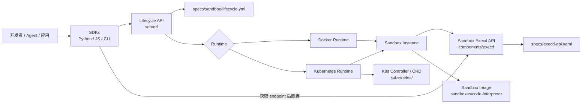
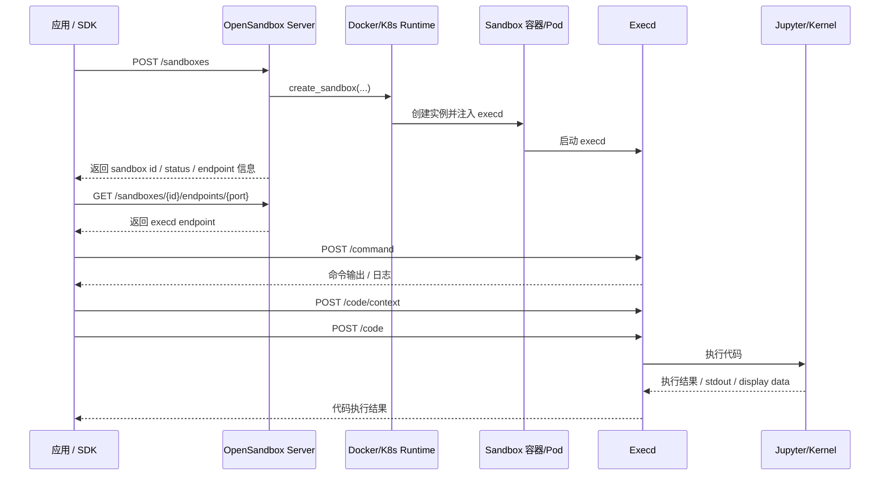
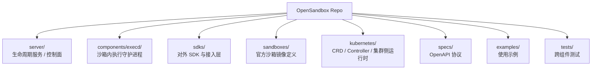

# OpenSandbox 项目初版整体认知

> 说明  
> 本文基于仓库源码、目录结构、配置文件和少量文档的静态阅读整理，目的是帮助新人快速建立“第一版全局认知”。  
> 重点依据包括：`README.md`、`docs/architecture.md`、`server/opensandbox_server/main.py`、`server/opensandbox_server/api/lifecycle.py`、`server/opensandbox_server/services/docker.py`、`server/opensandbox_server/services/k8s/kubernetes_service.py`、`components/execd/main.go`、`components/execd/pkg/web/router.go`、`sdks/sandbox/python/src/opensandbox/sandbox.py`、`sdks/code-interpreter/python/src/code_interpreter/code_interpreter.py`、`sandboxes/code-interpreter/Dockerfile`。  
> 未实际启动整套系统，因此少量运行时细节仍属于“静态判断”或“推测”。

## 项目是做什么的

### 用一句话概括项目目标

OpenSandbox 是一个面向 AI 应用场景的通用沙箱平台，提供统一的沙箱生命周期管理、执行能力接口、多语言 SDK，以及 Docker / Kubernetes 运行时。

### 它主要解决什么问题

- 解决“如何为 AI Agent / Code Interpreter / 评测任务 / 自动化任务创建隔离运行环境”的问题。
- 解决“如何用统一 API 管理沙箱创建、销毁、续期、命令执行、文件操作、代码执行”的问题。
- 解决“本地单机 Docker 和大规模 Kubernetes 调度之间如何保持一致接入方式”的问题。

### 典型使用场景

- Coding Agent 在隔离容器里执行命令、读写文件、跑代码。
- Code Interpreter 场景下执行 Python / Java / JS / Go 等多语言代码。
- AI 评测、批量任务、训练或推理辅助任务需要大批量短时沙箱。
- 浏览器自动化、桌面环境、带网络控制的代理执行环境。

### 项目类型判断

- 这是一个“平台型项目”，不是单一应用。
- 更准确地说，它同时包含：
- 一个生命周期管理服务：`server/`
- 一个沙箱内执行守护进程：`components/execd/`
- 多语言 SDK：`sdks/`
- 一组沙箱镜像 / 运行环境定义：`sandboxes/`
- 一套 Kubernetes 控制器与 CRD：`kubernetes/`

### 依据

- `README.md` 明确把项目定义为 “general-purpose sandbox platform for AI applications”。
- `docs/architecture.md` 明确拆成 SDK、Specs、Runtime、Sandbox Instances 四层。
- `server/`、`components/execd/`、`sdks/`、`sandboxes/`、`kubernetes/` 的分工非常清晰，说明这不是普通单体服务。

## 技术栈与运行方式

### 核心语言、框架、依赖管理

- 生命周期服务端使用 Python + FastAPI。
- 依据：`server/pyproject.toml` 依赖里有 `fastapi`、`uvicorn`、`docker`、`kubernetes`；`server/opensandbox_server/main.py` 是 FastAPI 入口。
- 沙箱内执行守护进程使用 Go + Gin。
- 依据：`components/execd/go.mod` 依赖 `github.com/gin-gonic/gin`；`components/execd/main.go` 启动 Web 服务；`components/execd/pkg/web/router.go` 注册路由。
- SDK 至少包含 Python 和 JavaScript / TypeScript。
- 依据：`sdks/sandbox/python/`、`sdks/code-interpreter/python/`、`sdks/sandbox/javascript/package.json`。
- CLI 也是 Python。
- 依据：`cli/pyproject.toml`。
- K8s 控制器使用 Go。
- 依据：`kubernetes/cmd/controller/main.go` 和 `kubernetes/apis/...`。

### 项目如何启动、构建、测试、发布

- Server 本地开发通常在 `server/` 目录执行 `uv sync`，再 `uv run python -m opensandbox_server.main`。
- 依据：仓库根 `AGENTS.md`、`server/README.md`。
- Execd 可在 `components/execd/` 下 `go build -o bin/execd .` 构建。
- 依据：仓库根 `AGENTS.md`。
- Python CLI / SDK 采用 `pyproject.toml`；JavaScript SDK 采用 `package.json` + `pnpm`。
- Specs 文档由 `scripts/spec-doc/generate-spec.js` 生成。
- 端到端和跨组件测试分布在 `tests/`、`server/tests`、`components/execd/pkg/...`。

### 哪些配置文件最关键

- `server/opensandbox_server/config.py`
  负责读取和校验核心配置，默认读取 `~/.sandbox.toml`，也支持 `SANDBOX_CONFIG_PATH`。
- `server/opensandbox_server/examples/example.config.toml`
  最适合新人理解“最小可运行配置”。
- `server/pyproject.toml`
  能快速看出服务端依赖边界。
- `components/execd/go.mod`
  能看出 execd 是一个 Go Web 服务，而不是简单脚本。
- `specs/sandbox-lifecycle.yml`
  定义生命周期 API。
- `specs/execd-api.yaml`
  定义沙箱内执行 API。

### 本地运行最可能关注的环境变量、脚本、配置项

- `SANDBOX_CONFIG_PATH`
  指定服务端 TOML 配置路径。依据：`server/opensandbox_server/config.py`。
- `~/.sandbox.toml`
  默认配置文件位置。依据：`server/opensandbox_server/config.py` 和 `server/README.md`。
- `runtime.type`
  决定走 Docker 还是 Kubernetes。依据：`server/opensandbox_server/services/factory.py`。
- `runtime.execd_image`
  决定注入哪个 execd 镜像。依据：`server/opensandbox_server/examples/example.config.toml`。
- `[docker] network_mode`
  影响 endpoint 暴露与代理方式。依据：`server/opensandbox_server/examples/example.config.toml`。
- `[ingress]`
  决定 direct / gateway 两种暴露方式。依据：`server/opensandbox_server/config.py`。
- `[egress]`
  决定网络出口控制能力。依据：`server/opensandbox_server/examples/example.config.toml`。
- `scripts/code-interpreter.sh`
  官方 code-interpreter 沙箱镜像的启动脚本入口。依据：`sandboxes/code-interpreter/Dockerfile`。

## 目录结构速览

这里只讲最重要的目录和文件。

- `server/`
  控制面。负责沙箱生命周期 API、鉴权、配置、运行时选择、Docker / K8s 编排。
- `components/execd/`
  数据面。运行在沙箱内部，真正执行命令、文件操作、代码执行、指标采集。
- `sdks/`
  对外接入层。把“先创建沙箱，再连 execd 执行”的流程包装成易用 API。
- `sandboxes/`
  官方沙箱环境定义。比如 `code-interpreter` 镜像会预装 Jupyter 和多语言 kernel。
- `kubernetes/`
  K8s 侧控制器、CRD、调度逻辑。偏大规模运行时能力，不是单纯 Helm 包。
- `specs/`
  协议契约层。生命周期 API 与 execd API 的 OpenAPI 规格。
- `examples/`
  最适合快速看“使用姿势”，尤其是 SDK 如何与 server / sandbox 协作。
- `tests/`
  跨组件 E2E 与语言侧集成测试，可帮助反推主链路。

### 目录之间如何协作

- `sdks/` 先调用 `server/` 暴露的生命周期 API 创建沙箱。
- `server/` 再调用 Docker 或 Kubernetes 运行时把沙箱实例拉起，并把 `execd` 注入进去。
- 沙箱起来后，`sdks/` 再拿 endpoint 去调用沙箱内的 `components/execd/`。
- `sandboxes/` 决定这个沙箱里本来装了什么运行时能力，比如 code interpreter 需要 Jupyter。
- `specs/` 是上面几层共同依赖的契约。

## 核心运行流程

### 从“启动”到“主要功能执行”的主链路

1. 服务启动时，`server/opensandbox_server/main.py` 加载配置、初始化 FastAPI、注册生命周期路由、代理路由、Pool 路由，并在 `lifespan` 中做运行时校验。
2. 客户端通过 SDK 或 REST 调用 `POST /sandboxes`，入口在 `server/opensandbox_server/api/lifecycle.py`。
3. 生命周期 API 调用 `create_sandbox_service()`，按 `runtime.type` 选择 `DockerSandboxService` 或 `KubernetesSandboxService`。依据：`server/opensandbox_server/services/factory.py`。
4. 如果是 Docker 路径，`server/opensandbox_server/services/docker.py` 负责拉镜像、创建容器、注入 `execd` 和 `bootstrap.sh`，再启动用户 entrypoint。
5. 如果是 Kubernetes 路径，`server/opensandbox_server/services/k8s/kubernetes_service.py` 调用 workload provider；provider 可能是 `batchsandbox` 或 `agent-sandbox`。依据：`server/opensandbox_server/services/k8s/provider_factory.py`。
6. 沙箱实例就绪后，SDK 通过 `Sandbox.get_endpoint()` 拿到 `execd` 暴露端点，然后对 `/command`、`/files/*`、`/code` 等接口发请求。依据：`sdks/sandbox/python/src/opensandbox/sandbox.py`、`sdks/code-interpreter/python/src/code_interpreter/code_interpreter.py`。
7. `execd` 收到请求后，由 `components/execd/pkg/web/router.go` 分发到不同 controller；命令执行走 `/command`，代码执行走 `/code`，文件系统走 `/files/*`。
8. 对于 code interpreter，`execd` 背后不是简单 `python -c`，而是 Jupyter session / context 模型。依据：`sandboxes/code-interpreter/Dockerfile`、`sdks/code-interpreter/python/src/code_interpreter/code_interpreter.py`。

### Web / API 请求如何流转

- 生命周期请求：Client -> FastAPI Server -> Runtime Service -> Docker / K8s -> Sandbox Instance
- 沙箱执行请求：Client -> Execd Endpoint -> Controller -> Runtime / Filesystem / Jupyter / Command 执行层
- 代理请求：Client -> Server Proxy 或 Execd 内部 Proxy -> Sandbox 内具体业务端口

### 无法完全确认或需要标注“推测”的点

- `specs/` 和部分文档强调创建是异步 `202 Accepted` + `Pending`，但从 Docker / K8s 服务实现看，创建过程中存在等待容器 / Pod Ready 的逻辑；因此“接口是异步语义”可以确认，但“返回时一定还没 ready”无法确认，静态看更像“可能返回时已接近 ready”。
- 代理链路的优先级和实际生产部署方式依赖配置，尤其是 direct / server proxy / ingress gateway 的组合，静态代码能看出能力存在，但默认生产形态仍需结合实际部署确认。

## 核心模块拆解

### 1. `server/opensandbox_server/main.py` + `server/opensandbox_server/api/`

- 这是控制面的总入口。
- 负责 HTTP 接口、路由注册、鉴权、中间件、生命周期 API 和代理 API 暴露。
- 更偏平台编排和接口层，不直接执行命令。

### 2. `server/opensandbox_server/services/docker.py`

- 这是 Docker 运行时主实现。
- 负责创建容器、注入 execd、处理 endpoint、网络、过期清理、资源限制。
- 如果你主要目标是“本地先跑起来”，这里是最关键的服务实现文件。

### 3. `server/opensandbox_server/services/k8s/`

- 这是 Kubernetes 运行时实现层。
- `kubernetes_service.py` 负责生命周期对接；`provider_factory.py` 负责 provider 选择；`batchsandbox_provider.py` 负责具体 CRD 工作负载拼装。
- 这里更偏基础设施和编排能力，不是业务逻辑，但它是理解“大规模运行”的关键。

### 4. `components/execd/`

- 这是沙箱内真正执行事情的地方。
- `main.go` 启动服务，`pkg/web/router.go` 注册 API，`pkg/runtime/` 负责命令、Jupyter、文件系统、bash session 等能力。
- 如果你在追“命令为什么这么执行”“代码为什么能保留上下文”，最后一定会来到这里。

### 5. `sdks/sandbox/python/`

- 这是对外最核心的接入封装。
- `Sandbox` 把生命周期管理、文件、命令、指标、endpoint 获取包装起来。
- 更接近用户使用体验，也是理解“项目希望别人怎么用”的最好入口。

### 6. `sdks/code-interpreter/python/`

- 这是在普通 Sandbox 之上再包一层 Code Interpreter 能力。
- 它清楚体现了一个设计思想：基础设施能力和代码解释能力分层。
- `CodeInterpreter.create(sandbox)` 说明项目并不是把“解释器”直接做成另一套平台，而是建立在通用沙箱之上。

### 7. `sandboxes/code-interpreter/` + `kubernetes/`

- `sandboxes/code-interpreter/` 体现官方推荐的运行环境是什么样。
- `kubernetes/` 体现平台级大规模交付能力，比如 BatchSandbox、Pool、Controller。
- 前者更偏“环境定义”，后者更偏“集群基础设施”。

## 我作为新接手的人，优先该看什么

### 建议阅读顺序

1. `README.md`
   先建立项目边界、官方定位、最小使用案例。
2. `docs/architecture.md`
   迅速确认它不是单一服务，而是 SDK + 协议 + Runtime + Sandbox Instance 四层。
3. `server/opensandbox_server/main.py`
   看服务怎么启动、注册了哪些能力、核心 API 面在哪里。
4. `server/opensandbox_server/api/lifecycle.py`
   看生命周期 API 的“平台表面”，理解外部如何创建和管理沙箱。
5. `server/opensandbox_server/services/docker.py`
   看默认 / 本地最常用运行时到底怎么把沙箱拉起来、怎么注入 execd。
6. `components/execd/main.go` 与 `components/execd/pkg/web/router.go`
   看沙箱内部能力暴露了哪些 API，以及这些能力大致分到哪些模块。
7. `sdks/sandbox/python/src/opensandbox/sandbox.py`
   从使用者视角串起来理解“先 lifecycle，再 execd”这条主链路。

### 如果目标是“快速跑起来”，阅读重点不同

- 优先看 `server/README.md`
- 优先看 `server/opensandbox_server/examples/example.config.toml`
- 优先看 `README.md` 里的 Python 示例
- 优先看 `sdks/sandbox/python/README.md` 或 `examples/`
- 这条路径重点是配置、启动、endpoint、最小调用闭环。

### 如果目标是“准备二次开发”，阅读重点不同

- 优先看 `server/opensandbox_server/api/lifecycle.py`
- 优先看 `server/opensandbox_server/services/docker.py`
- 优先看 `components/execd/pkg/runtime/`
- 优先看 `specs/sandbox-lifecycle.yml` 与 `specs/execd-api.yaml`
- 这条路径重点是接口契约、模块边界、扩展点和真实调用链。

## 设计特点与架构判断

### 这个项目属于什么架构风格

- 明显是“控制面 / 数据面分离”架构。
- 也是“协议驱动 + 多运行时适配”架构。
- 在 K8s 分支上，又叠加了“Provider / CRD / Controller”式扩展架构。

### 能确认的几个设计特点

- 明显分层。
  `server` 管生命周期，`execd` 管执行，`sdks` 管接入体验，`specs` 管契约。
- 有运行时插件化倾向。
  `server/opensandbox_server/services/factory.py` 用工厂选择 Docker / Kubernetes；`provider_factory.py` 再选择 K8s workload provider。
- 有配置分层。
  `config.py` 把 server / runtime / docker / ingress / egress / renew_intent 等配置拆开。
- 有网络代理分层。
  既有 server proxy，也有 execd 内部 proxy，还支持 gateway ingress 与 egress sidecar。
- 有池化与调度能力。
  `api/pool.py`、`batchsandbox_provider.py` 说明 K8s 路径不只是“起一个 Pod”，而是考虑预热池和批量调度。
- Code Interpreter 是增量能力，不是另起炉灶。
  它是在通用 Sandbox 之上叠加的。

### 哪些设计是理解成本的关键

- “server 不执行命令，execd 才执行命令”这件事必须记住。
- “创建沙箱”和“进入沙箱执行任务”是两条 API，不是一条 API。
- 网络暴露不是单一路径，而是 direct / proxy / gateway 并存。
- Kubernetes 不是简单替换 Docker，而是引入了 provider、pool、CRD、controller 一整套新复杂度。

## 潜在难点与风险

### 新人最容易卡住的地方

- 误以为 `server` 就是最终执行层，实际上真正执行在 `components/execd/`。
- 误以为 SDK 只连一个服务，实际上通常先连 lifecycle API，再连 execd endpoint。
- 误以为 code interpreter 是独立平台，实际上它是建立在 Sandbox 之上的一层包装。
- 误以为 K8s 运行时和 Docker 完全同构，实际上 K8s 多了 provider、pool、CRD、controller。

### 哪些地方耦合高或调试成本高

- 网络相关路径耦合较高。
  endpoint、server proxy、execd proxy、ingress gateway、egress sidecar 叠在一起，排障成本不低。
- 生命周期状态语义可能存在“文档与实现不完全同步”的情况。
- Docker / K8s 双运行时导致很多逻辑要看两份实现才能确认。
- Code Interpreter 的真实执行链路跨越 SDK、execd、Jupyter、镜像环境，跨度较大。

### 代码与文档可能不一致的地方

- `components/execd/README.md` 里提到 Beego，但当前代码实际使用 Gin。依据：`components/execd/pkg/web/router.go`。
- `docs/architecture.md` 里写 TypeScript SDK 是 Roadmap，但仓库里已经有 `sdks/sandbox/javascript/package.json`。
- `server/pyproject.toml` 的描述里还写 Kubernetes planned，但 `server/README.md` 和 `server/opensandbox_server/services/k8s/` 已显示 Kubernetes 已实现。
- `tests/python/README.md` 中部分路径描述与当前目录结构不完全一致。这个点建议后续实查。

## 图表辅助理解

### 图 1：项目整体架构图



怎么看这张图：

- 先把 `server` 和 `execd` 分开记：前者是控制面，后者是数据面。
- SDK 不是只调一个 API，它会先走 lifecycle，再走 execd。
- `specs/` 不是辅助文档，而是项目多层协作的契约中心。
- Docker 和 Kubernetes 只是两种运行时后端，对上层尽量保持统一接口。

### 图 2：核心执行流程图



怎么看这张图：

- 这条链路最值得记住的是“两段式调用”。
- 第一段是创建和管理沙箱，第二段才是进入沙箱执行命令或代码。
- `/command` 与 `/code` 背后不是同一套执行模型，后者更接近 Jupyter 会话。
- 如果你调试“创建成功但执行失败”，通常要把问题拆成 server 阶段和 execd 阶段分别排查。

### 图 3：目录与模块映射图



怎么看这张图：

- 这张图适合建立“这个目录是干什么的”第一印象。
- 真正需要优先投入注意力的通常是 `server/`、`components/execd/`、`sdks/` 三块。
- `sandboxes/` 和 `kubernetes/` 很重要，但更偏“运行环境”和“集群能力”。
- `specs/` 在理解接口边界时价值很高，尤其适合做二次开发前对齐契约。

### 图 4：网络与代理链路图

```mermaid
flowchart LR
    Client[Client / SDK] --> Direct[直接访问 sandbox endpoint]
    Client --> ServerProxy[server proxy<br/>/sandboxes/{id}/proxy/{port}]
    Client --> Gateway[Ingress Gateway<br/>推测：取决于 ingress.mode]

    ServerProxy --> SandboxPort[Sandbox 业务端口]
    Direct --> SandboxPort
    Gateway --> SandboxPort

    SandboxPort --> ExecdProxy[execd 内部 /proxy/{port}]
    SandboxPort --> Service[Sandbox 内业务服务]

    Service --> Egress[Egress Sidecar<br/>可选]
    Egress --> Internet[外部网络]
```

怎么看这张图：

- 这张图主要帮助你理解为什么网络问题会比较难排查。
- 入口不止一条，至少有 direct、server proxy、gateway 三类思路。
- 出口也可能不是直接出网，而是经过 egress sidecar。
- 其中 gateway 和部分代理细节受配置影响较大，图中已标注有“推测”成分。

## 初版认知总结

- OpenSandbox 不是一个单体应用，而是一套“沙箱平台”。
- `server/` 负责生命周期管理，`components/execd/` 负责真正执行。
- 典型链路不是“一次请求做完所有事”，而是“先创建沙箱，再连进去执行”。
- Docker 路径更适合本地跑通，Kubernetes 路径更适合理解大规模调度。
- Code Interpreter 不是脱离 Sandbox 独立存在，而是建立在 Sandbox 之上的增强能力。
- `specs/` 很关键，它定义了 server 和 execd 的 API 契约。
- 网络层是理解成本较高的区域，因为同时存在 direct、proxy、gateway、egress。
- K8s 路径的关键不是 Pod 本身，而是 provider、pool、CRD、controller。
- 文档和代码存在少量不一致，遇到冲突时应优先相信当前代码。

## 下一步阅读计划

### 30 分钟内先看什么

- 文件：`README.md`、`docs/architecture.md`、`server/README.md`
- 目标：建立项目目标、四层架构、最小运行方式的第一印象。
- 预期收获：知道项目是平台不是单服务，知道它至少分 server / execd / SDK / runtime 这几层。

### 2 小时内应该搞清什么

- 文件：`server/opensandbox_server/main.py`、`server/opensandbox_server/api/lifecycle.py`、`server/opensandbox_server/services/factory.py`、`server/opensandbox_server/services/docker.py`、`components/execd/main.go`、`components/execd/pkg/web/router.go`
- 目标：搞清楚 lifecycle API 怎么接请求、怎么选运行时、怎么把 execd 带进沙箱、execd 暴露了哪些能力。
- 预期收获：能独立讲清“创建一个沙箱后，命令 / 文件 / 代码请求是怎么流转的”。

### 1 天内应该补齐什么

- 文件：`sdks/sandbox/python/src/opensandbox/sandbox.py`、`sdks/code-interpreter/python/src/code_interpreter/code_interpreter.py`、`sandboxes/code-interpreter/Dockerfile`、`server/opensandbox_server/services/k8s/`、`kubernetes/`、`specs/`
- 目标：补齐 SDK 视角、code interpreter 视角、K8s 视角和协议视角。
- 预期收获：能判断自己后续应该沿“本地 Docker 开发线”还是“集群运行时线”继续深挖，也能开始准备二次开发或问题定位。

## 最后一句给新人的抓手

理解 OpenSandbox，最有效的抓手不是先啃所有实现细节，而是先牢牢记住这条主线：

`SDK/Client -> server 管生命周期 -> runtime 拉起 sandbox -> execd 在沙箱里执行命令/文件/代码`

只要这条主线清楚了，后面看到 Docker、Kubernetes、Code Interpreter、Pool、Proxy 这些复杂能力时，你都会知道它们是在主链路的哪个位置上“加能力”，而不是从零重新理解一遍。
