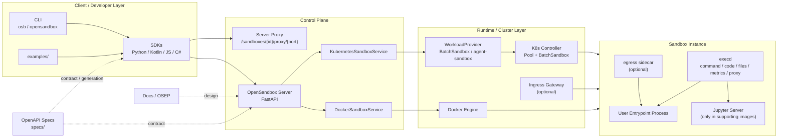
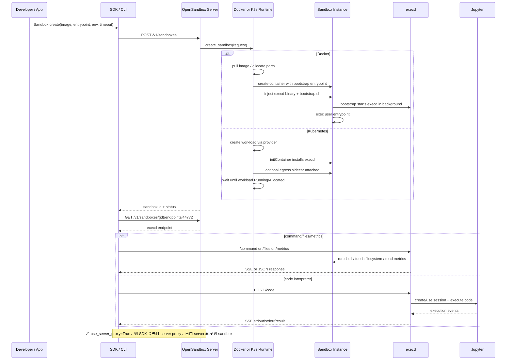
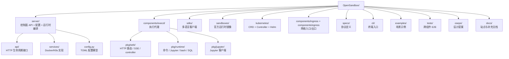
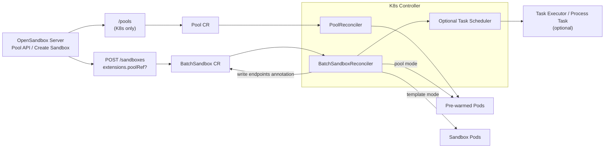

先说明边界：这版结论主要来自对仓库实际文件、入口代码、配置和关键实现的静态阅读；我没有实际把服务跑起来，也没有完整审阅 `.github/workflows`、所有多语言 SDK 和 `agent-sandbox` provider 的细节。所以“完整发布流水线”和“某些边缘运行时行为”我会明确标注为“无法确认”或“初步判断”。

**项目是做什么的**
- 一句话概括：它是一个给 AI Agent / 代码执行 / 浏览器自动化 / 桌面环境等场景提供“统一、隔离、可编程执行环境”的通用 Sandbox 平台。依据：[README.md](d:/vibe/OpenSandbox/README.md)、[docs/architecture.md](d:/vibe/OpenSandbox/docs/architecture.md)
- 它主要解决的问题：把“创建隔离环境、注入执行代理、执行命令/代码、读写文件、控制网络、暴露端口、回收生命周期、适配 Docker/Kubernetes”统一成一套 API 和 SDK，而不是让业务方自己拼这些底层能力。依据：[server/README.md](d:/vibe/OpenSandbox/server/README.md)、[docker.py](d:/vibe/OpenSandbox/server/opensandbox_server/services/docker.py)、[workload_provider.py](d:/vibe/OpenSandbox/server/opensandbox_server/services/k8s/workload_provider.py)
- 典型使用场景：Coding Agent、Code Interpreter、浏览器自动化、远程桌面、批量 RL/评测任务、带网络策略的隔离执行。依据：[README.md](d:/vibe/OpenSandbox/README.md)、[examples/README.md](d:/vibe/OpenSandbox/examples/README.md)
- 类型判断：这不是单一应用，更像一个“平台型基础设施 monorepo”，里面同时有服务端、SDK、CLI、Kubernetes Operator、运行时镜像、网络组件和示例。依据：[README.md](d:/vibe/OpenSandbox/README.md)、[cli/README.md](d:/vibe/OpenSandbox/cli/README.md)、[kubernetes/README.md](d:/vibe/OpenSandbox/kubernetes/README.md)

**技术栈与运行方式**
- 核心语言是 Python、Go、TypeScript/JavaScript，外加 Kotlin/C# SDK。控制面主要是 Python/FastAPI，执行面和 K8s 组件主要是 Go。依据：[server/pyproject.toml](d:/vibe/OpenSandbox/server/pyproject.toml)、[components/execd/go.mod](d:/vibe/OpenSandbox/components/execd/go.mod)、[kubernetes/go.mod](d:/vibe/OpenSandbox/kubernetes/go.mod)、[sdks/sandbox/javascript/package.json](d:/vibe/OpenSandbox/sdks/sandbox/javascript/package.json)
- Python 侧依赖管理主要是 `uv` + `hatchling`；Go 侧是 Go modules；JS 侧是 `pnpm`。依据：[server/pyproject.toml](d:/vibe/OpenSandbox/server/pyproject.toml)、[cli/pyproject.toml](d:/vibe/OpenSandbox/cli/pyproject.toml)、[sdks/package.json](d:/vibe/OpenSandbox/sdks/package.json)
- 本地启动最核心的是 `server/`。最快路径是生成 `~/.sandbox.toml`，然后启动 `opensandbox-server`。依据：[server/README.md](d:/vibe/OpenSandbox/server/README.md)、[server/opensandbox_server/cli.py](d:/vibe/OpenSandbox/server/opensandbox_server/cli.py)
- Docker 是本地运行的关键前提；如果你想跑代码解释器，还需要使用 `opensandbox/code-interpreter` 这类带 Jupyter 和多语言内核的镜像。依据：[README.md](d:/vibe/OpenSandbox/README.md)、[sandboxes/code-interpreter/Dockerfile](d:/vibe/OpenSandbox/sandboxes/code-interpreter/Dockerfile)
- K8s 路线不是单纯“把 server 部署到集群”这么简单，它还包含 CRD、controller、池化和批量交付逻辑。依据：[kubernetes/cmd/controller/main.go](d:/vibe/OpenSandbox/kubernetes/cmd/controller/main.go)、[kubernetes/apis/sandbox/v1alpha1/batchsandbox_types.go](d:/vibe/OpenSandbox/kubernetes/apis/sandbox/v1alpha1/batchsandbox_types.go)
- 这个仓库看起来是“多包单仓、分组件发布”，不是一个统一制品。Python 包、CLI、SDK 都各自有自己的 tag/version 规则；JS SDK 也单独 publish。依据：[server/pyproject.toml](d:/vibe/OpenSandbox/server/pyproject.toml)、[cli/pyproject.toml](d:/vibe/OpenSandbox/cli/pyproject.toml)、[sdks/sandbox/python/pyproject.toml](d:/vibe/OpenSandbox/sdks/sandbox/python/pyproject.toml)、[sdks/package.json](d:/vibe/OpenSandbox/sdks/package.json)

**最关键的配置 / 环境变量**
- `~/.sandbox.toml` 或 `SANDBOX_CONFIG_PATH`：这是 server 的总配置入口。依据：[server/opensandbox_server/config.py](d:/vibe/OpenSandbox/server/opensandbox_server/config.py)、[server/opensandbox_server/examples/example.config.toml](d:/vibe/OpenSandbox/server/opensandbox_server/examples/example.config.toml)
- `[runtime].type` 与 `[runtime].execd_image`：决定走 Docker 还是 Kubernetes，以及给 sandbox 注入哪个 `execd` 镜像。依据：[server/opensandbox_server/examples/example.config.toml](d:/vibe/OpenSandbox/server/opensandbox_server/examples/example.config.toml)
- `[docker].network_mode`、`[docker].host_ip`：直接影响 endpoint 暴露方式，尤其是 bridge 模式。依据：[server/opensandbox_server/examples/example.config.toml](d:/vibe/OpenSandbox/server/opensandbox_server/examples/example.config.toml)、[docker.py](d:/vibe/OpenSandbox/server/opensandbox_server/services/docker.py)
- `[egress].image`、`[egress].mode`：只要请求里带 `networkPolicy`，这一段就会变重要。依据：[server/opensandbox_server/examples/example.config.toml](d:/vibe/OpenSandbox/server/opensandbox_server/examples/example.config.toml)、[components/egress/README.md](d:/vibe/OpenSandbox/components/egress/README.md)
- `OPEN-SANDBOX-API-KEY` / `OPEN_SANDBOX_API_KEY`：server API 鉴权头/环境变量。依据：[server/README.md](d:/vibe/OpenSandbox/server/README.md)、[sdks/sandbox/python/src/opensandbox/config/connection.py](d:/vibe/OpenSandbox/sdks/sandbox/python/src/opensandbox/config/connection.py)
- `PYTHON_VERSION`、`JAVA_VERSION`、`NODE_VERSION`、`GO_VERSION`：给 code-interpreter 镜像选择语言版本。依据：[sandboxes/code-interpreter/Dockerfile](d:/vibe/OpenSandbox/sandboxes/code-interpreter/Dockerfile)、[sandboxes/code-interpreter/scripts/code-interpreter.sh](d:/vibe/OpenSandbox/sandboxes/code-interpreter/scripts/code-interpreter.sh)
- `JUPYTER_HOST`、`JUPYTER_TOKEN`、`X-EXECD-ACCESS-TOKEN`：这是 `execd` 自己的依赖和鉴权。依据：[components/execd/pkg/flag/parser.go](d:/vibe/OpenSandbox/components/execd/pkg/flag/parser.go)、[components/execd/pkg/web/model/header.go](d:/vibe/OpenSandbox/components/execd/pkg/web/model/header.go)

**目录结构速览**
- [`server/`](d:/vibe/OpenSandbox/server)：控制面。负责 sandbox 生命周期 API、配置加载、鉴权、中间件、Docker/K8s 运行时编排。它是大多数新人最先该看的地方。依据：[server/opensandbox_server/main.py](d:/vibe/OpenSandbox/server/opensandbox_server/main.py)
- [`components/execd/`](d:/vibe/OpenSandbox/components/execd)：执行面代理。跑在 sandbox 内部，提供命令执行、文件系统、代码执行、指标和端口 proxy。依据：[components/execd/main.go](d:/vibe/OpenSandbox/components/execd/main.go)、[components/execd/pkg/web/router.go](d:/vibe/OpenSandbox/components/execd/pkg/web/router.go)
- [`sdks/`](d:/vibe/OpenSandbox/sdks)：多语言客户端。它们先调 lifecycle API，再连进 sandbox 内部 `execd`。Python SDK 还明显带了 OpenAPI 生成产物。依据：[sdks/sandbox/python/src/opensandbox/sandbox.py](d:/vibe/OpenSandbox/sdks/sandbox/python/src/opensandbox/sandbox.py)、[sdks/sandbox/python/pyproject.toml](d:/vibe/OpenSandbox/sdks/sandbox/python/pyproject.toml)
- [`sandboxes/`](d:/vibe/OpenSandbox/sandboxes)：官方运行时镜像定义。`code-interpreter` 是最典型的“带 Jupyter、多语言内核”的标准环境。依据：[sandboxes/code-interpreter/Dockerfile](d:/vibe/OpenSandbox/sandboxes/code-interpreter/Dockerfile)
- [`kubernetes/`](d:/vibe/OpenSandbox/kubernetes)：K8s operator / CRD / Helm / controller 代码。这里实现的是“高吞吐批量 sandbox 交付”和池化，不只是普通部署清单。依据：[kubernetes/cmd/controller/main.go](d:/vibe/OpenSandbox/kubernetes/cmd/controller/main.go)、[kubernetes/internal/controller](d:/vibe/OpenSandbox/kubernetes/internal/controller)
- [`components/ingress/`](d:/vibe/OpenSandbox/components/ingress) 和 [`components/egress/`](d:/vibe/OpenSandbox/components/egress)：网络入口/出口能力。前者做反向代理路由，后者做域名级出网控制。依据：[components/ingress/README.md](d:/vibe/OpenSandbox/components/ingress/README.md)、[components/egress/README.md](d:/vibe/OpenSandbox/components/egress/README.md)
- [`specs/`](d:/vibe/OpenSandbox/specs)：协议合同层。server 和 SDK 都围绕这里的 OpenAPI 规格组织。依据：[specs/README.md](d:/vibe/OpenSandbox/specs/README.md)
- [`cli/`](d:/vibe/OpenSandbox/cli)：终端入口，基本上是同步 Python SDK 的一层 Click 包装。依据：[cli/src/opensandbox_cli/client.py](d:/vibe/OpenSandbox/cli/src/opensandbox_cli/client.py)
- [`examples/`](d:/vibe/OpenSandbox/examples)：用例集合，不是核心实现，但非常适合新人建立“这东西能拿来干什么”的直觉。依据：[examples/README.md](d:/vibe/OpenSandbox/examples/README.md)
- [`oseps/`](d:/vibe/OpenSandbox/oseps)：设计提案档案，适合后续深挖设计动机。依据：[oseps/README.md](d:/vibe/OpenSandbox/oseps/README.md)

**目录之间如何协作**
- `specs` 定协议。
- `sdks` 和 `cli` 面向开发者。
- `server` 实现生命周期管理。
- `server` 创建出来的 sandbox 内部跑 `execd`，执行真正的命令/文件/代码操作。
- `sandboxes` 提供官方镜像，`kubernetes` 提供集群级高吞吐运行时。
- `ingress/egress` 负责网络入口和出口策略。

**核心运行流程**
1. 启动 `opensandbox-server` 时，会先加载 TOML 配置、初始化日志、中间件和路由，然后按 `[runtime].type` 创建 `DockerSandboxService` 或 `KubernetesSandboxService`。依据：[server/opensandbox_server/main.py](d:/vibe/OpenSandbox/server/opensandbox_server/main.py)、[server/opensandbox_server/services/factory.py](d:/vibe/OpenSandbox/server/opensandbox_server/services/factory.py)
2. SDK/CLI 创建 sandbox 时，先调用 lifecycle API `POST /sandboxes`。FastAPI 路由在 [`lifecycle.py`](d:/vibe/OpenSandbox/server/opensandbox_server/api/lifecycle.py) 做参数校验，再把逻辑转交给 runtime service。依据：[server/opensandbox_server/api/lifecycle.py](d:/vibe/OpenSandbox/server/opensandbox_server/api/lifecycle.py)、[server/opensandbox_server/api/schema.py](d:/vibe/OpenSandbox/server/opensandbox_server/api/schema.py)
3. Docker 路线下，server 会拉镜像、准备 labels/env/端口映射、按需拉起 egress sidecar，然后创建用户容器；创建后又把 `execd` 二进制和一个 bootstrap 脚本复制进去，再以 bootstrap 作为容器入口。bootstrap 会先启动 `execd`，再 `exec` 用户自己的 entrypoint。依据：[server/opensandbox_server/services/docker.py](d:/vibe/OpenSandbox/server/opensandbox_server/services/docker.py)、[server/opensandbox_server/services/constants.py](d:/vibe/OpenSandbox/server/opensandbox_server/services/constants.py)
4. Kubernetes 路线下，server 会把请求委托给 `WorkloadProvider`。默认看起来更偏向 `BatchSandboxProvider`，它会构造 CRD/PodSpec、加入 `execd` init 能力、按需挂 egress sidecar，然后等待 workload 进入 Running/Allocated。依据：[server/opensandbox_server/services/k8s/kubernetes_service.py](d:/vibe/OpenSandbox/server/opensandbox_server/services/k8s/kubernetes_service.py)、[server/opensandbox_server/services/k8s/provider_factory.py](d:/vibe/OpenSandbox/server/opensandbox_server/services/k8s/provider_factory.py)、[server/opensandbox_server/services/k8s/batchsandbox_provider.py](d:/vibe/OpenSandbox/server/opensandbox_server/services/k8s/batchsandbox_provider.py)
5. SDK 拿到 sandbox id 后，会继续解析 44772 端口的 endpoint，把 `commands/files/metrics/health` 等服务都绑定到这个 endpoint 上；如果是 CodeInterpreter，再额外创建 code service。依据：[sdks/sandbox/python/src/opensandbox/sandbox.py](d:/vibe/OpenSandbox/sdks/sandbox/python/src/opensandbox/sandbox.py)、[sdks/code-interpreter/python/src/code_interpreter/code_interpreter.py](d:/vibe/OpenSandbox/sdks/code-interpreter/python/src/code_interpreter/code_interpreter.py)
6. 调 `sandbox.commands.run()` 时，请求会打到 sandbox 内 `execd` 的 `/command`；调 `interpreter.codes.run()` 时，请求打到 `/code`，由 `execd` 再分派到 shell、Jupyter kernel、bash session 或 SQL executor。依据：[components/execd/pkg/web/router.go](d:/vibe/OpenSandbox/components/execd/pkg/web/router.go)、[components/execd/pkg/runtime/ctrl.go](d:/vibe/OpenSandbox/components/execd/pkg/runtime/ctrl.go)
7. `execd` 对代码执行使用 Jupyter session/kernel，对命令执行直接起子进程，对外通过 SSE 持续推送 stdout/stderr/result/status。依据：[components/execd/pkg/runtime/context.go](d:/vibe/OpenSandbox/components/execd/pkg/runtime/context.go)、[components/execd/pkg/runtime/jupyter.go](d:/vibe/OpenSandbox/components/execd/pkg/runtime/jupyter.go)、[components/execd/pkg/runtime/command.go](d:/vibe/OpenSandbox/components/execd/pkg/runtime/command.go)、[components/execd/pkg/web/controller/sse.go](d:/vibe/OpenSandbox/components/execd/pkg/web/controller/sse.go)
8. 端口访问有多层模式。Docker bridge 下，容器 8080 会直接映射到宿主机端口；其他端口通常走 `execd` 的 `/proxy/{port}`；如果客户端无法直接打到 sandbox，还可以让 SDK 开 `use_server_proxy=True`，走 server 的 `/sandboxes/{id}/proxy/{port}` 二次代理。依据：[server/opensandbox_server/services/docker.py](d:/vibe/OpenSandbox/server/opensandbox_server/services/docker.py)、[components/execd/pkg/web/proxy.go](d:/vibe/OpenSandbox/components/execd/pkg/web/proxy.go)、[server/opensandbox_server/api/proxy.py](d:/vibe/OpenSandbox/server/opensandbox_server/api/proxy.py)、[sdks/sandbox/python/src/opensandbox/config/connection.py](d:/vibe/OpenSandbox/sdks/sandbox/python/src/opensandbox/config/connection.py)

**核心模块拆解**
- `server/opensandbox_server`
  负责控制面，是“先创建/销毁 sandbox，再告诉你怎么连进去”的那一层。更偏业务编排和平台接口。依据：[server/opensandbox_server/main.py](d:/vibe/OpenSandbox/server/opensandbox_server/main.py)
- `server/opensandbox_server/services/docker.py`
  负责本地 Docker 运行时，是当前最容易理解的一条主链路。它体现了这个项目最核心的想法：把 `execd` 注入到任意用户镜像里。依据：[docker.py](d:/vibe/OpenSandbox/server/opensandbox_server/services/docker.py)
- `server/opensandbox_server/services/k8s`
  负责 K8s 运行时，里面又进一步抽象成 `WorkloadProvider`，支持 `batchsandbox` / `agent-sandbox`。更偏基础设施抽象。依据：[workload_provider.py](d:/vibe/OpenSandbox/server/opensandbox_server/services/k8s/workload_provider.py)、[provider_factory.py](d:/vibe/OpenSandbox/server/opensandbox_server/services/k8s/provider_factory.py)
- `components/execd`
  负责 sandbox 内执行能力，是数据面核心。命令、文件、代码、指标、内部代理都在这里。依据：[components/execd/main.go](d:/vibe/OpenSandbox/components/execd/main.go)、[components/execd/pkg/web/router.go](d:/vibe/OpenSandbox/components/execd/pkg/web/router.go)
- `sandboxes/code-interpreter`
  负责官方“代码解释器环境”，本质是一个预置多语言内核的镜像。更接近运行时环境而不是控制逻辑。依据：[sandboxes/code-interpreter/Dockerfile](d:/vibe/OpenSandbox/sandboxes/code-interpreter/Dockerfile)、[sandboxes/code-interpreter/scripts/code-interpreter.sh](d:/vibe/OpenSandbox/sandboxes/code-interpreter/scripts/code-interpreter.sh)
- `sdks/sandbox/python` 与 `sdks/code-interpreter/python`
  负责对开发者暴露稳定 API。它们很重要，因为你能从这里一眼看出“项目希望用户怎么用”。依据：[sdks/sandbox/python/src/opensandbox/sandbox.py](d:/vibe/OpenSandbox/sdks/sandbox/python/src/opensandbox/sandbox.py)、[sdks/code-interpreter/python/src/code_interpreter/code_interpreter.py](d:/vibe/OpenSandbox/sdks/code-interpreter/python/src/code_interpreter/code_interpreter.py)
- `kubernetes/internal/controller`
  负责 K8s 下的池化、批量分配和可选任务调度，是这个项目区别于“普通容器控制 API”的重要增强点。依据：[kubernetes/internal/controller/batchsandbox_controller.go](d:/vibe/OpenSandbox/kubernetes/internal/controller/batchsandbox_controller.go)、[kubernetes/internal/controller/pool_controller.go](d:/vibe/OpenSandbox/kubernetes/internal/controller/pool_controller.go)

**我作为新接手的人，优先该看什么**
1. [README.md](d:/vibe/OpenSandbox/README.md)  
为什么先看：先建立“这不是单一服务，而是一整套平台”的总体定位。
2. [server/README.md](d:/vibe/OpenSandbox/server/README.md)  
为什么先看：最快看懂本地怎么启动，以及控制面的职责边界。
3. [server/opensandbox_server/examples/example.config.toml](d:/vibe/OpenSandbox/server/opensandbox_server/examples/example.config.toml)  
为什么先看：这份文件比长文档更能告诉你系统真正依赖哪些配置。
4. [server/opensandbox_server/main.py](d:/vibe/OpenSandbox/server/opensandbox_server/main.py)  
为什么先看：这是服务启动入口，能看到路由、中间件、runtime 初始化顺序。
5. [server/opensandbox_server/services/docker.py](d:/vibe/OpenSandbox/server/opensandbox_server/services/docker.py)  
为什么先看：如果你想最快吃透主链路，这个文件最值钱。
6. [components/execd/pkg/web/router.go](d:/vibe/OpenSandbox/components/execd/pkg/web/router.go) 和 [components/execd/pkg/runtime](d:/vibe/OpenSandbox/components/execd/pkg/runtime)  
为什么先看：你会知道 sandbox 里到底能做什么，以及 `/command`、`/code`、`/files` 各自落到哪里。
7. [sdks/sandbox/python/src/opensandbox/sandbox.py](d:/vibe/OpenSandbox/sdks/sandbox/python/src/opensandbox/sandbox.py)  
为什么先看：这是“用户视角的主入口”，能反向帮助你理解服务设计。

如果你的目标是“快速跑起来”，重点看 1、2、3、5，再直接照根 README 的 Python 示例走一遍。  
如果你的目标是“准备二次开发”，重点看 4、5、6、7，再补看 [server/opensandbox_server/api/lifecycle.py](d:/vibe/OpenSandbox/server/opensandbox_server/api/lifecycle.py) 和 [server/opensandbox_server/api/schema.py](d:/vibe/OpenSandbox/server/opensandbox_server/api/schema.py)。  
如果你的目标是“K8s 架构”，把第 5 项换成 [server/opensandbox_server/services/k8s/kubernetes_service.py](d:/vibe/OpenSandbox/server/opensandbox_server/services/k8s/kubernetes_service.py) 和 [kubernetes/cmd/controller/main.go](d:/vibe/OpenSandbox/kubernetes/cmd/controller/main.go)。

**设计特点与架构判断**
- 这是明显的“控制面 / 数据面”分离架构。`server` 负责生命周期和资源编排，`execd` 负责 sandbox 内部执行。理解这一点，很多目录就会自然归位。依据：[server/opensandbox_server/main.py](d:/vibe/OpenSandbox/server/opensandbox_server/main.py)、[components/execd/main.go](d:/vibe/OpenSandbox/components/execd/main.go)
- 它带明显的 contract-first 倾向。`specs/` 先定义协议，Python SDK 和 JS SDK 里都能看到生成客户端的痕迹。依据：[specs/README.md](d:/vibe/OpenSandbox/specs/README.md)、[sdks/sandbox/python/pyproject.toml](d:/vibe/OpenSandbox/sdks/sandbox/python/pyproject.toml)、[sdks/sandbox/javascript/package.json](d:/vibe/OpenSandbox/sdks/sandbox/javascript/package.json)
- 运行时抽象做得比较明显。控制面先用 `SandboxService` 抽 Docker/K8s，再在 K8s 里用 `WorkloadProvider` 继续抽 `BatchSandbox` / `agent-sandbox`。这是它后续可扩展 runtime 的关键。依据：[sandbox_service.py](d:/vibe/OpenSandbox/server/opensandbox_server/services/sandbox_service.py)、[workload_provider.py](d:/vibe/OpenSandbox/server/opensandbox_server/services/k8s/workload_provider.py)
- 网络设计是这个项目理解成本最高的地方之一。它至少有“直接 endpoint、server proxy、ingress gateway、egress sidecar、execd 内部 proxy”几层。依据：[server/opensandbox_server/api/proxy.py](d:/vibe/OpenSandbox/server/opensandbox_server/api/proxy.py)、[components/execd/pkg/web/proxy.go](d:/vibe/OpenSandbox/components/execd/pkg/web/proxy.go)、[components/ingress/README.md](d:/vibe/OpenSandbox/components/ingress/README.md)、[components/egress/README.md](d:/vibe/OpenSandbox/components/egress/README.md)
- 代码执行不是自己发明协议，而是复用了 Jupyter kernel/session 模型；同时又保留了直接 shell command 和独立 bash session 两种模式。依据：[components/execd/pkg/runtime/context.go](d:/vibe/OpenSandbox/components/execd/pkg/runtime/context.go)、[components/execd/pkg/runtime/bash_session.go](d:/vibe/OpenSandbox/components/execd/pkg/runtime/bash_session.go)、[components/execd/pkg/runtime/command.go](d:/vibe/OpenSandbox/components/execd/pkg/runtime/command.go)
- K8s 路线有明显的 operator 思维：CRD + controller + reconcile + pool + batchsandbox + optional task scheduling。不是把 Docker 逻辑简单平移过去。依据：[kubernetes/apis/sandbox/v1alpha1/batchsandbox_types.go](d:/vibe/OpenSandbox/kubernetes/apis/sandbox/v1alpha1/batchsandbox_types.go)、[kubernetes/internal/controller](d:/vibe/OpenSandbox/kubernetes/internal/controller)
- 没看到重型 DI/插件框架；更多是手工 factory、抽象类、注册表和 `extensions` 这种轻量扩展点。依据：[server/opensandbox_server/services/factory.py](d:/vibe/OpenSandbox/server/opensandbox_server/services/factory.py)、[server/opensandbox_server/services/k8s/provider_factory.py](d:/vibe/OpenSandbox/server/opensandbox_server/services/k8s/provider_factory.py)、[server/opensandbox_server/extensions/validation.py](d:/vibe/OpenSandbox/server/opensandbox_server/extensions/validation.py)

**潜在难点与风险**
- 文档和实现有几处明显不一致。
  - `execd` README 说“Built on Beego”，但实际代码已经是 Gin。依据：[components/execd/README.md](d:/vibe/OpenSandbox/components/execd/README.md)、[components/execd/pkg/web/router.go](d:/vibe/OpenSandbox/components/execd/pkg/web/router.go)
  - 架构文档里写“TypeScript SDK (Roadmap)”，但仓库里已经有 JS/TS SDK 包。依据：[docs/architecture.md](d:/vibe/OpenSandbox/docs/architecture.md)、[sdks/sandbox/javascript/package.json](d:/vibe/OpenSandbox/sdks/sandbox/javascript/package.json)
  - `server/pyproject.toml` 还写着 Kubernetes planned，但 `server/README.md`、K8s service 和 controller 代码都已经是可用实现。依据：[server/pyproject.toml](d:/vibe/OpenSandbox/server/pyproject.toml)、[server/README.md](d:/vibe/OpenSandbox/server/README.md)、[server/opensandbox_server/services/k8s/kubernetes_service.py](d:/vibe/OpenSandbox/server/opensandbox_server/services/k8s/kubernetes_service.py)
  - lifecycle spec/route 仍然强调 `202 Accepted` + `Pending` 异步创建，但当前 Docker/K8s 实现实际更像“尽量等到可用再返回”。依据：[lifecycle.py#L58](d:/vibe/OpenSandbox/server/opensandbox_server/api/lifecycle.py#L58)、[sandbox-lifecycle.yml#L170](d:/vibe/OpenSandbox/specs/sandbox-lifecycle.yml#L170)、[docker.py#L1062](d:/vibe/OpenSandbox/server/opensandbox_server/services/docker.py#L1062)、[kubernetes_service.py#L368](d:/vibe/OpenSandbox/server/opensandbox_server/services/k8s/kubernetes_service.py#L368)
  - `tests/python/README.md` 里写的是 `tests/e2e/python`，实际目录是 `tests/python`。依据：[tests/python/README.md](d:/vibe/OpenSandbox/tests/python/README.md)、[tests/python/pyproject.toml](d:/vibe/OpenSandbox/tests/python/pyproject.toml)
- 新人最容易卡住的是“端口/代理/网络模式”。尤其是 Docker bridge、`host_ip`、`use_server_proxy`、`execd /proxy/{port}`、K8s ingress gateway 的关系。这个比业务 API 本身更容易把人绕晕。依据：[docker.py](d:/vibe/OpenSandbox/server/opensandbox_server/services/docker.py)、[proxy.py](d:/vibe/OpenSandbox/server/opensandbox_server/api/proxy.py)、[components/execd/pkg/web/proxy.go](d:/vibe/OpenSandbox/components/execd/pkg/web/proxy.go)
- 不是所有镜像都支持代码执行。`Sandbox` 基础能力只要求有 `execd`；`CodeInterpreter` 还要求镜像内部真的有 Jupyter 和多语言内核。依据：[sdks/code-interpreter/python/README.md](d:/vibe/OpenSandbox/sdks/code-interpreter/python/README.md)、[sandboxes/code-interpreter/Dockerfile](d:/vibe/OpenSandbox/sandboxes/code-interpreter/Dockerfile)
- K8s 路线耦合组件更多：server、provider、CRD、controller、optional task executor、ingress。出问题时排查面会明显比 Docker 大。依据：[kubernetes/cmd/controller/main.go](d:/vibe/OpenSandbox/kubernetes/cmd/controller/main.go)、[server/opensandbox_server/services/k8s](d:/vibe/OpenSandbox/server/opensandbox_server/services/k8s)
- `extensions` 和 OSEP 驱动功能会提升理解门槛，因为它们不是核心 schema 的显式一部分，而是“协议扩展位”。依据：[server/opensandbox_server/api/schema.py](d:/vibe/OpenSandbox/server/opensandbox_server/api/schema.py)、[server/opensandbox_server/extensions/validation.py](d:/vibe/OpenSandbox/server/opensandbox_server/extensions/validation.py)、[oseps/README.md](d:/vibe/OpenSandbox/oseps/README.md)
- `Pool` API 已经在 server 里实现了，但 lifecycle spec 里没看到对应 `/pools`，说明协议文档也在滞后。依据：[server/opensandbox_server/api/pool.py](d:/vibe/OpenSandbox/server/opensandbox_server/api/pool.py)、[specs/sandbox-lifecycle.yml](d:/vibe/OpenSandbox/specs/sandbox-lifecycle.yml)

**图表辅助理解**

图 1：项目整体架构图

- 这张图最重要的记忆点是“两层 API”：外层是 `server` 生命周期 API，内层是 sandbox 里的 `execd` 执行 API。
- `specs/` 不是文档附件，而是贯穿 SDK 和 server 的合同层。
- K8s 路线不是直接起 Pod，而是通过 provider + controller + CRD 管理。
- `Jupyter` 不是所有镜像都有，只有像 `code-interpreter` 这种镜像才会提供。
- `egress`、`ingress` 都是可选网络能力，不是每条链路必经。

图 2：核心执行流程图

- 这条链路说明：创建 sandbox 和在 sandbox 里执行代码，其实是两段完全不同的责任链。
- Docker 和 K8s 的“创建阶段”不同，但创建成功后，SDK 面对的 `execd` 能力会尽量保持一致。
- `code` 和 `command` 不是一个执行器：前者主要走 Jupyter，会话可持久化；后者是直接 shell 子进程。
- `use_server_proxy=True` 只是把访问路径改成“先到 server 再转发”，不会改变 `execd` 的能力模型。

图 3：目录与模块映射图

- 你可以把这个仓库先拆成三块来看：`server`、`execd`、`sdks`，其余目录先当配套能力。
- `sandboxes/` 是“运行环境定义”，不是业务逻辑；`examples/` 是“用法证明”，不是核心实现。
- `kubernetes/` 很重要，但它是第二阶段要看的复杂度，不建议一上来就扎进去。
- `specs/` 很值得留意，因为它决定了 SDK 和 server 的公共语言。

图 4：Kubernetes 池化与批量交付机制图

- 这张图只在 K8s 路线成立，本地 Docker 不需要理解这一套。
- `Pool` 的目标是把冷启动成本前置，`BatchSandbox` 的目标是一次性交付很多 sandbox。
- `extensions.poolRef` 是 server 侧把普通 create 请求接到池化交付路径上的桥。
- 可选任务调度不是附带脚本，而是 controller 里的一套正式 reconcile 逻辑。

**初版认知总结**
- 这个项目的核心抓手不是“某个 SDK”，而是“统一 Sandbox 协议 + 控制面 + 执行面”。
- `server` 管生命周期，`execd` 管 sandbox 内部执行，这是最关键的脑图。
- Docker 路线的本质，是把 `execd` 注入到用户镜像里，而不是要求用户镜像天生就支持 OpenSandbox。
- Code Interpreter 不是魔法，它基本上是“带 Jupyter 的官方镜像 + execd 的 `/code` 接口 + SDK 包装”。
- K8s 路线的亮点不只是运行在集群里，而是池化、批量交付和可选任务调度。
- 网络访问路径有点绕：直接 endpoint、execd proxy、server proxy、ingress gateway 需要分清。
- `specs/` 很重要，因为它决定 SDK 和 server 的公共边界。
- `examples/` 对理解场景非常有帮助，但它们不是主实现。
- 文档存在一些滞后，读代码比只读 README 更靠谱。
- 新人第一阶段最值得吃透的是 Docker 主链路，不是 Kubernetes。

**下一步阅读计划**

**30 分钟内我先看什么**
- 文件： [README.md](d:/vibe/OpenSandbox/README.md)、[server/README.md](d:/vibe/OpenSandbox/server/README.md)、[server/opensandbox_server/examples/example.config.toml](d:/vibe/OpenSandbox/server/opensandbox_server/examples/example.config.toml)
- 目标：确认项目定位、本地运行前提、最小配置项、Docker 默认路径。
- 预期收获：知道“这东西先起 server，再用 SDK/CLI 创建 sandbox”，也知道 `~/.sandbox.toml` 是第一入口。

**2 小时内我应该搞清什么**
- 文件： [server/opensandbox_server/main.py](d:/vibe/OpenSandbox/server/opensandbox_server/main.py)、[server/opensandbox_server/api/lifecycle.py](d:/vibe/OpenSandbox/server/opensandbox_server/api/lifecycle.py)、[server/opensandbox_server/services/docker.py](d:/vibe/OpenSandbox/server/opensandbox_server/services/docker.py)、[components/execd/pkg/web/router.go](d:/vibe/OpenSandbox/components/execd/pkg/web/router.go)、[components/execd/pkg/runtime/context.go](d:/vibe/OpenSandbox/components/execd/pkg/runtime/context.go)、[components/execd/pkg/runtime/command.go](d:/vibe/OpenSandbox/components/execd/pkg/runtime/command.go)
- 目标：彻底搞清“创建 sandbox”和“在 sandbox 内执行代码/命令”这两段主链路。
- 预期收获：能自己讲清楚 `server -> runtime -> sandbox -> execd -> Jupyter/shell` 这条调用链。

**1 天内我应该补齐什么**
- 文件： [sdks/sandbox/python/src/opensandbox/sandbox.py](d:/vibe/OpenSandbox/sdks/sandbox/python/src/opensandbox/sandbox.py)、[sdks/code-interpreter/python/src/code_interpreter/code_interpreter.py](d:/vibe/OpenSandbox/sdks/code-interpreter/python/src/code_interpreter/code_interpreter.py)、[server/opensandbox_server/api/proxy.py](d:/vibe/OpenSandbox/server/opensandbox_server/api/proxy.py)、[components/execd/pkg/web/proxy.go](d:/vibe/OpenSandbox/components/execd/pkg/web/proxy.go)、[components/egress/README.md](d:/vibe/OpenSandbox/components/egress/README.md)、[kubernetes/cmd/controller/main.go](d:/vibe/OpenSandbox/kubernetes/cmd/controller/main.go)、[kubernetes/internal/controller/batchsandbox_controller.go](d:/vibe/OpenSandbox/kubernetes/internal/controller/batchsandbox_controller.go)
- 目标：补齐开发者视角、网络访问路径、K8s 高级能力。
- 预期收获：你会从“会用”升级到“能判断改动落在哪层、会影响哪条链路”。

本轮我没有实际启动服务或跑测试，所以对“当前环境下能否一键跑通”的结论还不能算确认。如果你愿意，下一步我可以继续给你做一版“按本仓库主链路的源码阅读地图”，或者直接带你从 `server -> docker.py -> execd -> SDK` 做一次更细的串读。